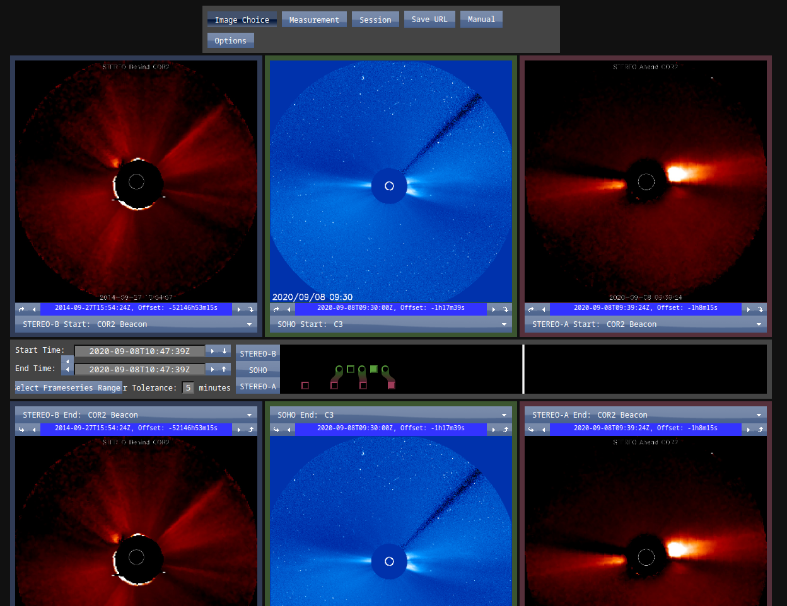
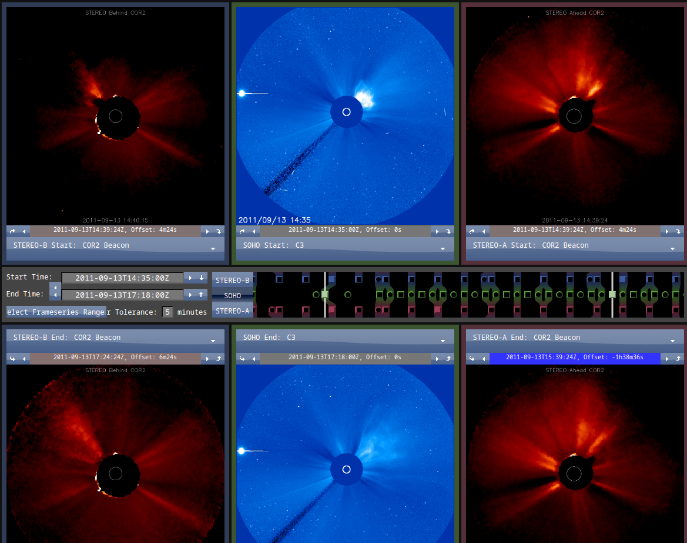
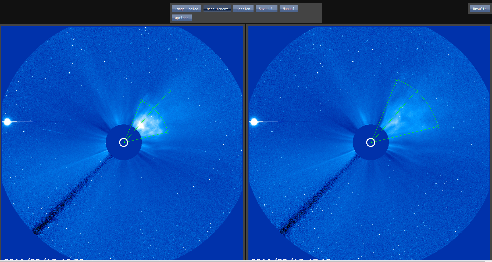
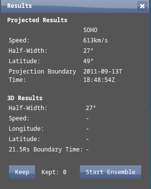

# Arbitrary CME Propagation Speed Calculations
In this Exercise, we will:
- Learn to find CMEs from a CME catalogue.
- Extract relevant information from the CME, such as propagation speed.

## Resources

### CME Catalogues
- [CACTUS CME Catalogue](http://sidc.oma.be/cactus/catalog.php) Automatic CME Detection

- [LASCO CME Catalogue](https://cdaw.gsfc.nasa.gov/CME_list/) Manual CME Detection

<!-- ### CME + Solar Wind Models
- [DONKI](https://kauai.ccmc.gsfc.nasa.gov/DONKI/) Space Weather Database of Notifications, Knowledge, Information  -->

### CME Analysis Tools
- [StereoCAT](https://ccmc.gsfc.nasa.gov/stereocat/)

### Data Sources
- [Solar Terrestrial Relations Observatory (STEREO)](https://stereo.gsfc.nasa.gov/) - A pair of space-based solar observatories (STEREO A, STEREO B) with orbital periods of 347 and 387, respectively. STEREO B has been out of commission since October 1 2014, with STEREO A continuing to work as intended. Check [here](https://stereo-ssc.nascom.nasa.gov/where.shtml) for past and future positions of the STEREO spacecraft.
  
- [Solar Dynamics Observatory (SDO)](https://sdo.gsfc.nasa.gov/mission/) - A space-based solar observatory that employs an inclined geosynchronous orbit to allow continuous high-cadence, high-resolution measurements of the Sun. 

- [Solar and Heliospheric Observatory (SOHO)](http://sohowww.nascom.nasa.gov/) - A space-based solar observatory that orbits the Sun at the Lagrange 1 (L1) point.

## Finding a CME suitable for analysis

We begin by finding a CME which:
1. Is suggested to be selected from the year 2011
2. Is preferrably not Earth-Directed (no Halo) 

If we look at September of 2011 on the [LASCO CME catalogue](https://cdaw.gsfc.nasa.gov/CME_list/), we find a number of results that look like the following:

We discourage the use of any event that is qualified as "poor", but otherwise any CME should work for our purposes.

We choose to use the CME shown as "2011/09/13 16:12:05" CME Here, and verify the C2 daily overview link. We now verify that the CME is contained within the video, and that it propagates on a well-defined direction.

In the example from 13 September, through visual inspection of the Video file, we conclude that the CME initiates at about 13:30 UTC. 

## Analysing the CME

Now go to the [StereoCAT Website](https://ccmc.gsfc.nasa.gov/stereocat/), where the following overlay will be shown:

This is a complicated layout, so we will go one step at a time.

1. Select the relevant time range for our analysis. This can be done on the left side of the image. For our CME this will be 13:30 UTC on the 13 September 2011.
2. Use the "down" arrow besides the date selector to propagate the date down.
3. Now move the bottom date into the future using the right arrow.
4. To flick through available images, we use the image in the middle, which is from SOHO. We press the right arrow on the top middle figure, and find a time where the CME can be clearly observed. To propagate this time downwards, we use the curved arrow down.
5. We now use the same procedure on the bottom plot. Find a time *after* the time shown at the top, where the CME can clearly be seen, and use the curved arrow up to propagate this information to the analysis start and end times.
6. Check that you have something similar to the following image:  As you can see, we start at 14:35 and end at 18:00.
7. On the middle banner, click on spacecraft which you want to use. Here we will use SOHO exclusively. Spacecraft are selected when the button appears shaded
8. On the top of the page, click "Measurement"
9. Now use the different hollow circles to fit the arc shape to the CME at the two stages. Try to have the middle line across the direction of propagation of the event. Below, we show a solved example 
Where we constrain the shape to the edge of more dense plasma, e.g, the CME front.
10. Finally, on the top right of the page, press "Results". You should get a reasonable linear velocity. 

_Note: f the speed is too unrealistic (significantly different from the speeds found in LASCO CME catalogue), modify the shapes that you are fitting to more closely resemble the CME_

We have now inferred that our CME is propagating at a speed of ~600 km/s.

# Next Steps
The URL for the measurements can be found [Here](https://ccmc.gsfc.nasa.gov/analysis/stereo/?s=iswaA-webservice1.ccmc.gsfc.nasa.gov&v=3&c=_0_1_Untitled!sEnsemble__t__NAOQwRU_NAOWz3I_0_-1PPM_0_0_0_-1PPM_0_-7S1A_0_93ui_0_-3ft2__5_0_0_0__0_0_--__t__NAOQwRU_NAOs8Bc_0_-1PPM_0_0_0_-1PPM_0_1btY_0_0_0_-Op1M__5__t__NAOQwRU_NAOs8Bc_0_-1PPM_0_0_0_-1PPM_0_1btY_0_0_0_-Op1M__5_VV_Tv_8KeN_qy_8KeN_1BR_8KeN_Em_VV_Tv_CfaU_qy_CfaU_1BR_CfaU_Em_--_--_t__1___). 

With this knowledge, and thinking about the direction of almost CME (although one that preferably took place during the time STEREO B observations was available), you should be able to pick a suitable spacecraft and perform this analysis on any CME. 
